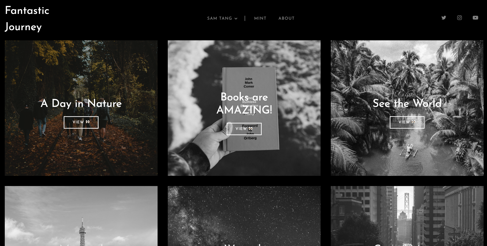
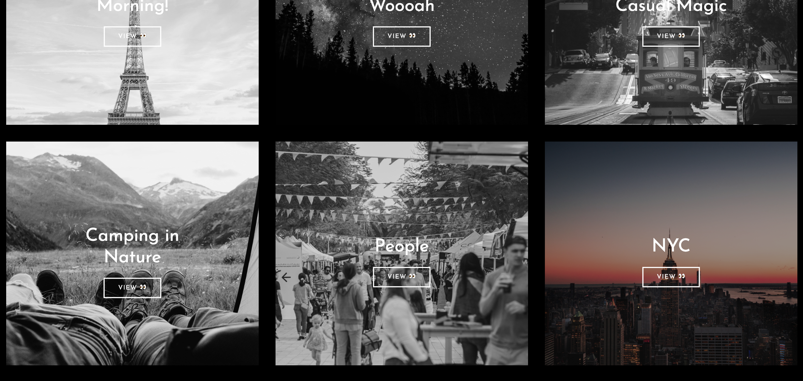
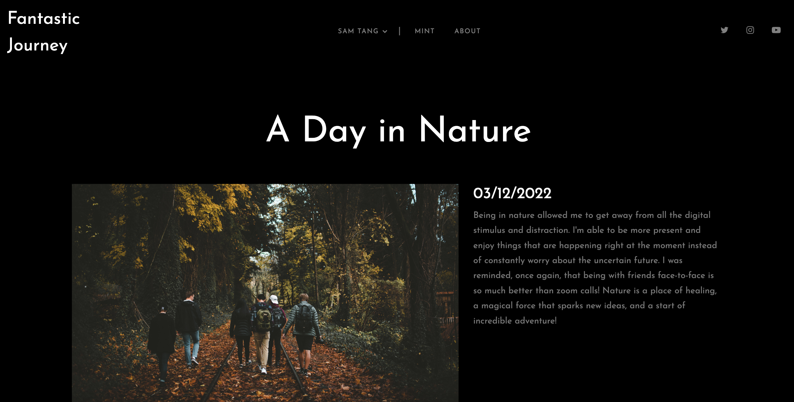
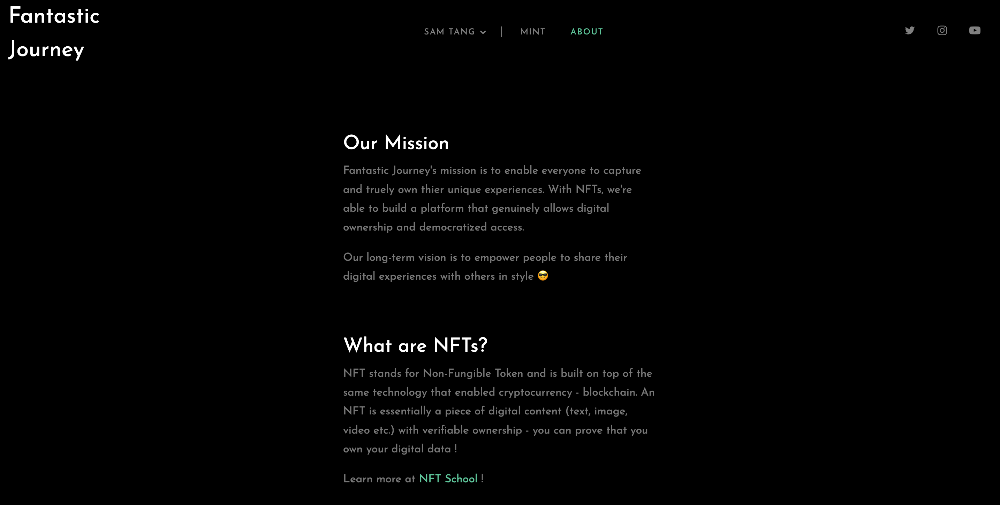
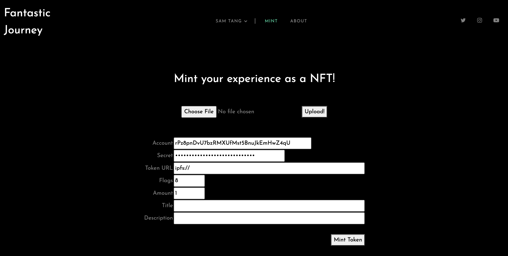

# Fantastic Journey - capture unique experiences with NFTs 

### Fantastic Journey is a platform to document your life journey with NFTs. The mission is to enable everyone to capture, share and truly own their unique experiences.    

Slides: [link](https://docs.google.com/presentation/d/1AlBzQOypCg_NxC9LPO--H8dyvdlbqtXgtilIsQ98BrE/edit?usp=sharing)  
Demo Video: https://youtu.be/60x5MBki23A   

## User Interface

### Notes 
Resources
* [XRP NFToken Tester Tutorial](https://xrpl.org/nftoken-tester-tutorial.html)   

Things I learned 
* [deploy local html to localhost](https://stackoverflow.com/questions/7943751/what-is-the-python-3-equivalent-of-python-m-simplehttpserver)
    * python3 -m http.server 8080 --bind 127.0.0.1 
* [add React to an existing website](https://reactjs.org/docs/add-react-to-a-website.html)
    * npx babel --watch src --out-dir . --presets react-app/prod
* [React.js Image Upload](https://academind.com/tutorials/reactjs-image-upload)
* [HTTP request in JavaScript with Ajax](https://www.freecodecamp.org/news/here-is-the-most-popular-ways-to-make-an-http-request-in-javascript-954ce8c95aaa/)
    * https://stackoverflow.com/questions/37654521/how-to-send-a-body-of-data-to-xmlhttprequest-that-looks-like-this 
 

